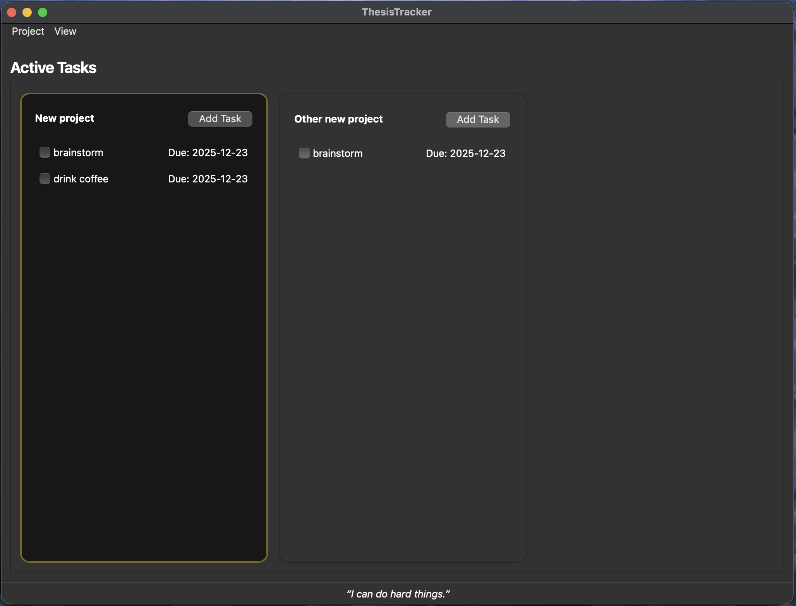
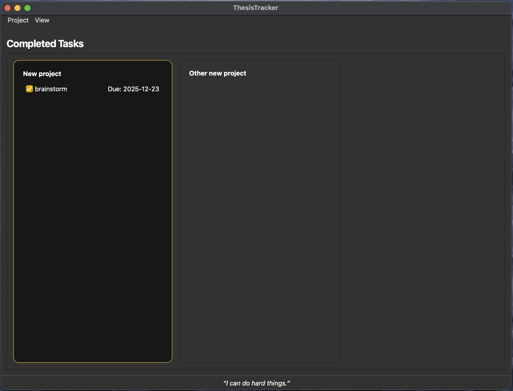

# ThesisTracker

A simple program for making thesis writing scheduling and to-do lists easy!

I wrote this after feeling that other notetaking or to-do list applications didn't meet my needs. This application is simple: it uses a local JSON file (see Syncing for use across computers) to store your projects and tasks. 

Each project (Command+N) creates a window, and tasks (Command+T) are sorted by date. While working on your tasks, they live on the active Tasks page (Command+1). When you complete a task, you click the check box, and it moves to the completed task page (Command+2), a record of your productivity. That's it!

Right now, this program is only available on MacOS, but will shortly be available on Windows and Linux. 

### To download:

Open the macOS folder and download the .dmg file.

## Syncing

To use this app on multiple computers, the JSON file should be located in a shared folder (e.g., Dropbox, OneDrive, iCloud). I use this program on two computers with a shared folder on Dropbox.

## Questions or bugs?
 Email me at eoleson (at) uark (dot) edu.